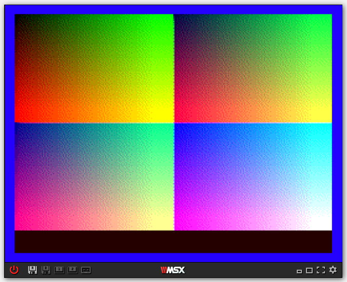
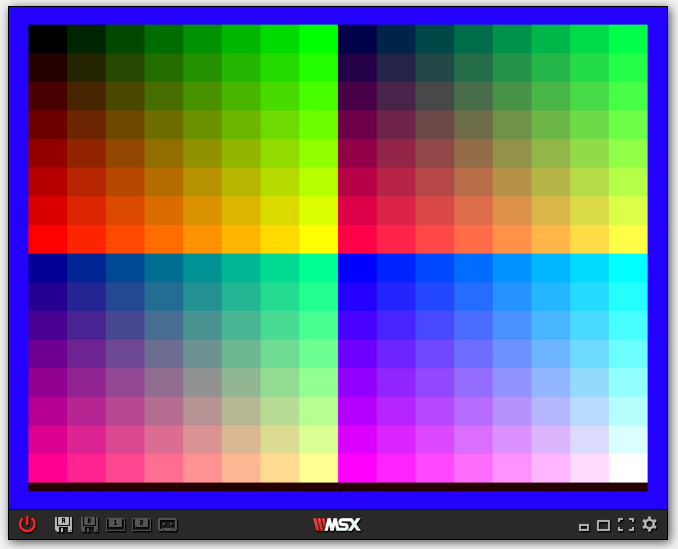
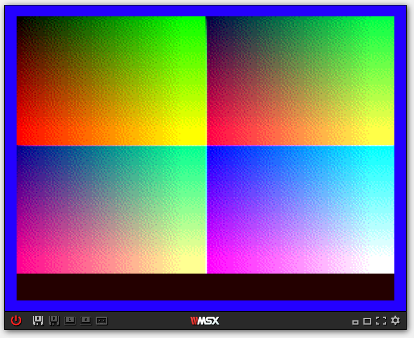

# Diffusion Color Bar for MSX



Running on WebMSX
http://webmsx.org/

Assembler is compiled with zmac
http://www.48k.ca/zmac.html

Create a disk image by ImDisk
http://www.ltr-data.se/opencode.html/#ImDisk

## How to run on WebMSX

Load the files under `msx` folder with the disk menu `Load "Files as Disk"`.

### Simple color bar
```
run "colors.bas"
```


### Diffusion color with BASIC
```
run "colors2.bas"
```
It will take 2 hours and 26 minuts.
After execution, it will save the screen as a file named `diff.sc8`



### Diffusion color with Assembler
```
run "colormac.bas"
```

